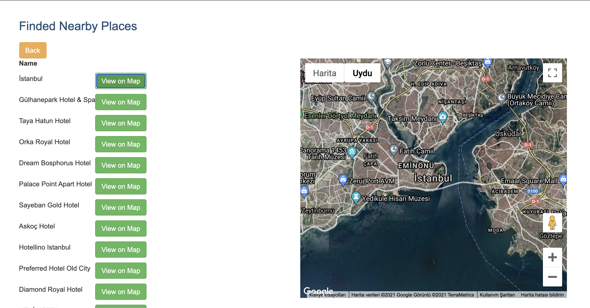

# Nearby Search Frontend Application

This frontend application has 3 input fields “longitude, latitude, radius” and displays nearby places result on a web page and the selected result can be viewed on the Google Maps. The application is fed by [Nearby Search Backend Application](https://github.com/meteergin/map-backend/blob/master/README.md) REST API and Google Maps API.

## Work Process

Application works on http://localhost:4200. Longitude, latitude and radius fields must not be empty.


If given longitude, latitude and radius data is valid Google API returns nearby places list. By clicking View on Map button, place can be viewed on Google Map.



## Usage

First of all [Nearby Search Backend Application](https://github.com/meteergin/map-backend/blob/master/README.md) must be started. Then, following commands must be run from terminal.


```bash
npm install
export NODE_OPTIONS=--openssl-legacy-provider
ng serve -o
```
If all steps are succeeded the frontend application works on http://localhost:4200 address.
